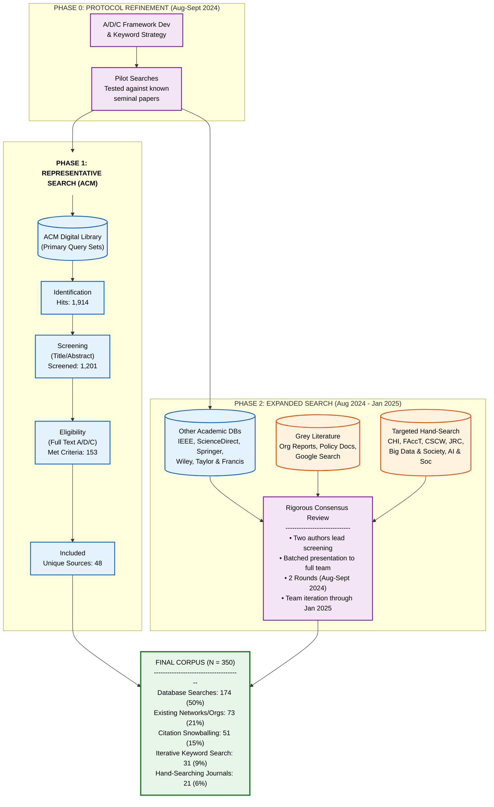

# AI Data Production Landscape

**Companion repository for the CHI 2026 paper submission:**  
*“Understanding AI Data Production & Community Impacts Worldwide: A Multivocal Literature Review”*

This repository contains the coded dataset, interactive source collections, and supplementary visualizations regarding the search and selection protocol used in our Multivocal Literature Review (MLR).

| 📄 **Paper** | 📊 **Dataset** | 🌐 **Website** |
| :--- | :--- | :--- |
| [**Read Draft (PDF)**](docs/REVISION_ADC_MultivocalV3.pdf) | [**Excel**](https://github.com/ADC-chi/ai-data-production-landscape/blob/main/data/processed/REVISED%20Datasheet.xlsx) · [**CSV**](https://github.com/ADC-chi/ai-data-production-landscape/blob/main/data/processed/REVISED%20Datasheet.csv) · [**Google Sheet**](https://docs.google.com/spreadsheets/d/1NJBIsDhtqp5CrCTJtfccObCneRLaRtoun6VfPuNTims/edit?usp=sharing) | [**Project Landing Page**](https://adc-chi.github.io/ai-data-production-landscape/) |

---

## 🔍 Methodology: Search & Selection Process
The following flow diagram details our attrition and selection protocol, integrating representative academic searches (ACM) with grey literature strategies. 

> **Note:** This figure supplements the methodology section of the submitted PDF.

# 🌊 Context: The AI Development Pipeline
We position data production not as a mere prerequisite, but as a site of sociotechnical power. The image below illustrates the interwoven domains of AI (A), Data Production (D), and Community Impacts (C).

---

# 📚 Interactive Resources
We have curated subsets of our corpus (open-access sources only, max 50 per collection) into interactive NotebookLM environments for easier exploration:

*   **[Extractive Patterns](https://notebooklm.google.com/notebook/a048fa59-64b2-4b13-a98e-0e739bca49d7)**  
    *Focus: Mechanisms that centralize control, obscure labor, or erase context.*
*   **[High-Agency Principles](https://notebooklm.google.com/notebook/f11a7a3b-dfbf-47a1-93e9-ee53683611ba)**  
    *Focus: Theoretical frameworks for refusal, sovereignty, and justice.*
*   **[High-Agency Practices](https://notebooklm.google.com/notebook/bd97ea3f-b516-48d5-b8c6-720ca8e47bca)**  
    *Focus: Applied methods, from co-design to federated data governance.*

---

**Contact:** chifod2025@gmail.com
